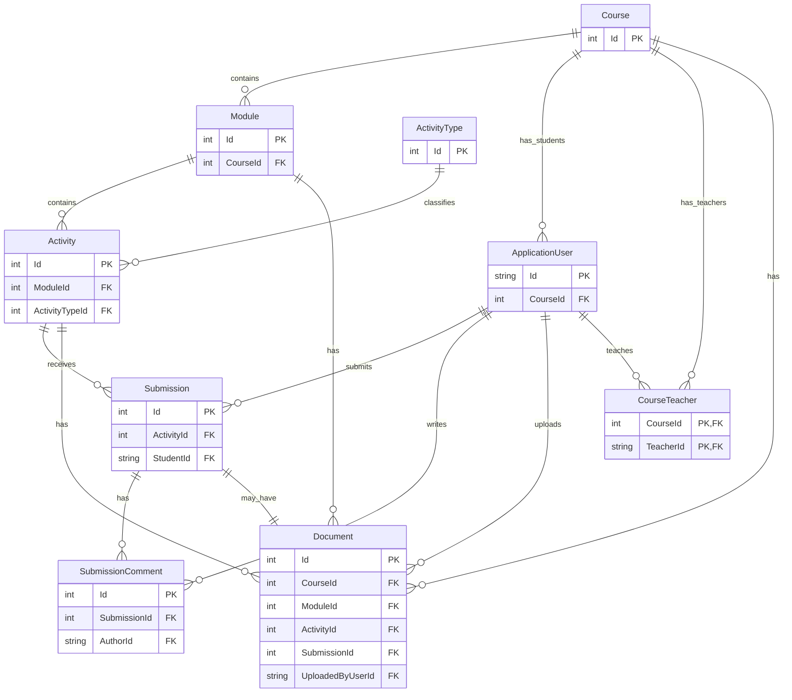

# .NET LMS student project

## Definition of Done
- [ ] Code builds successfully without errors
- [ ] Relevant functionality is tested manually (happy path + basic edge cases)
- [ ] No obvious bugs or broken flows in the UI
- [ ] API endpoints return correct status codes and responses
- [ ] Code follows agreed structure and naming conventions
- [ ] Add description of the PR in the PR description field, including what was changed
- [ ] At least one team member has reviewed the PR before merge
- [ ] Changes are merged into the correct branch (e.g. `develop`/`master`)

## Database Schema
