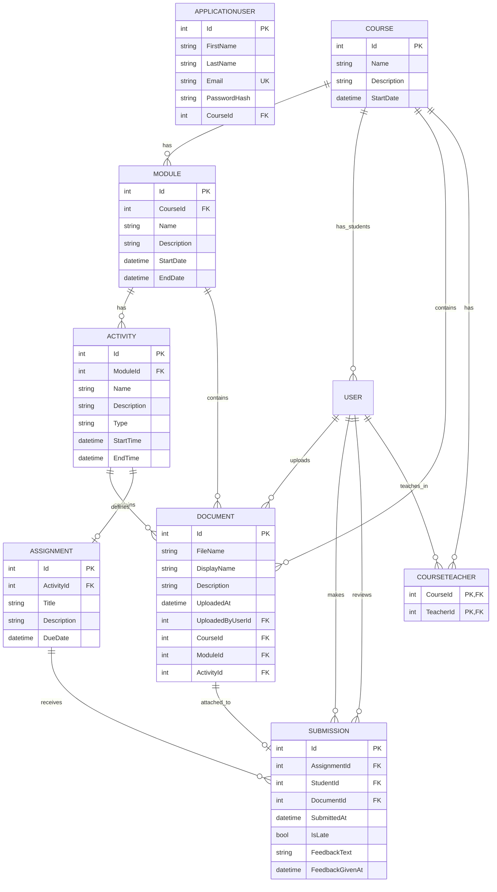

# .NET LMS student project

## Database Schema

```mermaid
erDiagram
    APPLICATIONUSER {
        int Id PK
        string FirstName
        string LastName
        string Email UK
        string PasswordHash
        int CourseId FK
    }

    COURSE {
        int Id PK
        string Name
        string Description
        datetime StartDate
    }

    MODULE {
        int Id PK
        int CourseId FK
        string Name
        string Description
        datetime StartDate
        datetime EndDate
    }

    ACTIVITY {
        int Id PK
        int ModuleId FK
        string Name
        string Description
        string Type
        datetime StartTime
        datetime EndTime
    }

    DOCUMENT {
        int Id PK
        string FileName
        string DisplayName
        string Description
        datetime UploadedAt
        int UploadedByUserId FK
        int CourseId FK
        int ModuleId FK
        int ActivityId FK
    }

    ASSIGNMENT {
        int Id PK
        int ActivityId FK
        string Title
        string Description
        datetime DueDate
    }

    SUBMISSION {
        int Id PK
        int AssignmentId FK
        int StudentId FK
        int DocumentId FK
        datetime SubmittedAt
        bool IsLate
        string FeedbackText
        datetime FeedbackGivenAt
    }

    COURSETEACHER {
        int CourseId PK, FK
        int TeacherId PK, FK
    }

    COURSE ||--o{ MODULE : has
    MODULE ||--o{ ACTIVITY : has
    COURSE ||--o{ USER : has_students
    USER ||--o{ DOCUMENT : uploads
    COURSE ||--o{ DOCUMENT : contains
    MODULE ||--o{ DOCUMENT : contains
    ACTIVITY ||--o{ DOCUMENT : contains
    ACTIVITY ||--o| ASSIGNMENT : defines
    ASSIGNMENT ||--o{ SUBMISSION : receives
    USER ||--o{ SUBMISSION : makes
    DOCUMENT ||--o| SUBMISSION : attached_to
    USER ||--o{ SUBMISSION : reviews
    COURSE ||--o{ COURSETEACHER : has
    USER ||--o{ COURSETEACHER : teaches_in
```